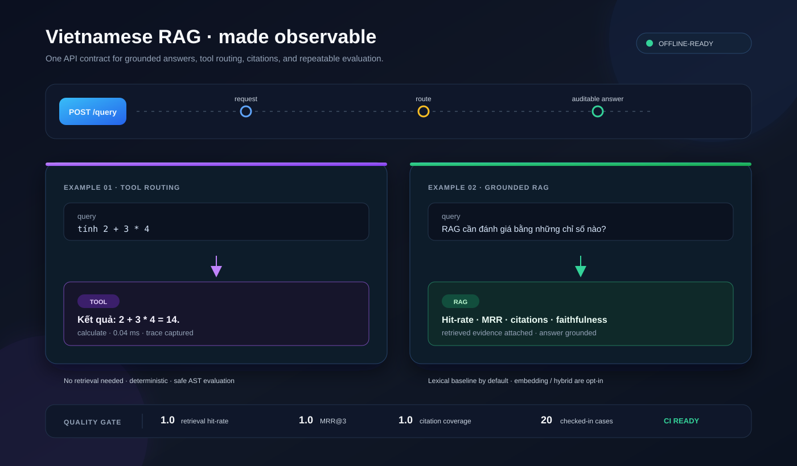
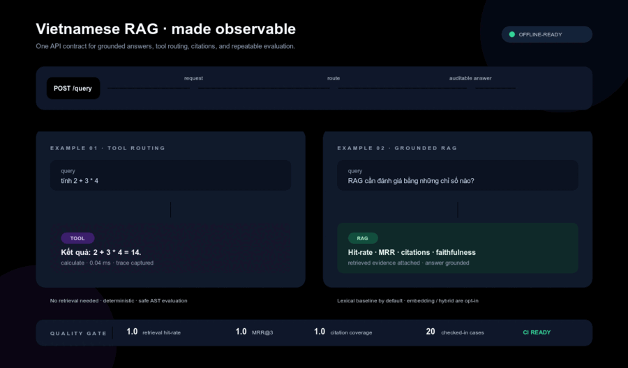
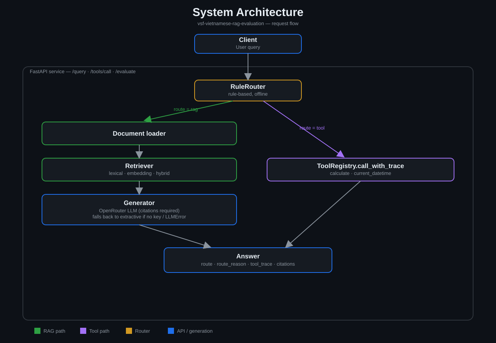

# Vietnamese RAG & LLM Evaluation Service

<p align="center">
  
</p>

<p align="center">
  <strong>Grounded answers, explicit routing, and measurable quality — in one small FastAPI service.</strong>
</p>

<p align="center">
  <a href="#quick-start">Quick start</a> ·
  <a href="#architecture">Architecture</a> ·
  <a href="#evaluation-api">Evaluation API</a> ·
  <a href="docs/demo.svg">Open demo SVG</a> ·
  <a href="docs/architecture.svg">Open architecture SVG</a>
</p>

[](https://github.com/khangkaka066/RAG-Vietnamese/actions/workflows/ci.yml)
[](pyproject.toml)
[](LICENSE)
[](Dockerfile)

> A provider-agnostic **Vietnamese RAG + agentic tool-routing** service that
> answers grounded in retrieved evidence (with citations), falls through to a
> tool (calculator, clock) when a query doesn't need retrieval at all, and
> ships with a repeatable, RAGAS-style evaluation harness — offline by
> default, LLM-backed (OpenRouter) when a key is configured.

**Why this exists:** most RAG demos stop at "retrieve + ask an LLM." This
project treats evaluation and routing as first-class: every answer carries
its citations and its routing decision, and quality is a number you can gate
CI on (`scripts/check_eval_gate.py`), not a vibe.



Animated transcript of real local HTTP responses using the checked-in Vietnamese dataset.
Includes two RAG questions with citations, a calculator call, and evaluation on all 20 cases.
[Raw responses](docs/demo-responses.json) · [Reproduce the recording](docs/demo-recording.md)

## What you get

| Capability | What it does |
| --- | --- |
| Grounded Vietnamese answers | Retrieves evidence, requires citations, and returns `UNAVAILABLE` when evidence is insufficient. |
| Explicit tool routing | Sends arithmetic and date/time queries to safe, traceable tools without touching retrieval. |
| Offline-first defaults | Lexical retrieval + extractive generation work without an API key or model download. |
| Evaluation as a gate | Measures hit-rate, MRR, citation coverage, faithfulness, relevancy, and latency in CI. |
| Production-shaped API | FastAPI, OpenAPI examples, Docker healthcheck, non-root container, and pluggable providers. |

**Real eval numbers** (checked-in 20-case set, offline lexical + extractive
baseline — see [Evaluation API](#evaluation-api) for the full table and the
LLM/embedding variants):

| `retrieval_hit_rate` | `retrieval_mrr_at_k` | `citation_coverage` | `faithfulness` | `answer_relevancy` |
| --- | --- | --- | --- | --- |
| 1.0 | 1.0 | 1.0 | ~0.94 | ~0.61 |

Status: **API, Docker, CI, tool routing, and evaluation are implemented.**

## Architecture



Everything downstream of `RuleRouter` is swappable behind an interface —
`Retriever`, `LLMProvider`/extractive generator, and `Tool` are all pluggable,
so the same request path works fully offline (CI/Docker default) or LLM/
embedding-backed (opt-in via env vars below) without changing the API.

The retriever is selected via `build_retriever(...)` and defaults to the deterministic
lexical (TF-IDF-style) baseline everywhere (app, Docker, CI) so the service stays fully
offline out of the box. A Vietnamese sentence-embedding retriever
(`bkai-foundation-models/vietnamese-bi-encoder`, via `sentence-transformers`) and a
hybrid retriever (weighted lexical + cosine score) are available as opt-in modes.

Answer generation is selected via `build_answer_engine(...)` and defaults to the
same offline, extractive baseline unless `OPENROUTER_API_KEY` is set, in which case
it calls an OpenRouter-hosted LLM (OpenAI-compatible `/chat/completions`) with a
Vietnamese system prompt that restricts the model to the retrieved context and
requires citation ids. Any LLM/network/parsing failure (`LLMError`) transparently
falls back to the extractive generator, so the API never hard-fails because of the
LLM provider. A future milestone will add reranking and online experiment tracking
without changing the API contract.

### Enabling LLM-based generation (OpenRouter)

```bash
cp .env.example .env
# edit .env and set OPENROUTER_API_KEY (get one at https://openrouter.ai/keys)
export $(grep -v '^#' .env | xargs)
uvicorn vietnamese_rag.api:app --app-dir src --reload
```

`OPENROUTER_MODEL` is optional and defaults to `openrouter/free` (OpenRouter's
official free auto-router). Without `OPENROUTER_API_KEY`, the service runs fully
offline using the rule-based extractive generator -- no code change required.

### Enabling embedding / hybrid retrieval

```bash
pip install -e '.[embeddings]'   # optional, pulls in sentence-transformers/torch
VIETNAMESE_RETRIEVER=hybrid uvicorn vietnamese_rag.api:app --app-dir src --reload
# VIETNAMESE_RETRIEVER accepts: lexical (default) | embedding | hybrid
```

`GET /health` reports the active retriever class (`"retriever": "LexicalRetriever"`,
`"EmbeddingRetriever"`, or `"HybridRetriever"`) for quick verification.

Compare hit-rate/MRR@3 across all three modes on the checked-in eval set:

```bash
python scripts/compare_retrievers.py
```

## Agent / tool routing

Every `/query` call first passes through a deterministic, offline **rule-based router**
(`RuleRouter` in `src/vietnamese_rag/router.py`) that classifies the query as either `"rag"`
(the Phase 1/2 retrieval+generation pipeline, unchanged) or `"tool"` (a registered tool
handles the query directly, with no retrieval call at all). Two tools are registered by
default (`src/vietnamese_rag/tools.py`):

- `calculate(expression)` — evaluates a whitelisted arithmetic expression
  (`+ - * / // % **`, parentheses) via a restricted `ast` walker. No `eval()`/`exec()`
  is ever used, so names, calls, attributes, and imports are always rejected.
- `current_datetime(timezone)` — looks up the current date/time in an IANA timezone
  (stdlib `zoneinfo`, defaults to `Asia/Ho_Chi_Minh`).

Every tool invocation (successful or not) is captured as a `ToolCallTrace` and returned
in the response, so the decision process stays fully auditable:

```json
{
  "query": "tính 2+3*4",
  "answer": "Kết quả: 2+3*4 = 14.",
  "status": "OK",
  "generator": "tool",
  "route": "tool",
  "route_reason": "Câu hỏi là một biểu thức số học; dùng tool calculate.",
  "tool_trace": [
    {"tool": "calculate", "arguments": {"expression": "2+3*4"}, "result": {"expression": "2+3*4", "result": 14}, "error": null, "duration_ms": 0.04}
  ]
}
```

A tool failure (e.g. `"tính 1/0"`) never crashes the API: it returns `status:
"UNAVAILABLE"` with the failure captured in `tool_trace[0]["error"]`. `GET /tools` and
`POST /tools/call` (the router and these endpoints share one `ToolRegistry`) let you
list/call tools directly; `POST /tools/call` returns `404` for an unknown tool name and
`400` for a `ToolError`/bad-argument failure instead of a `500`.

**Limitations**: the router is a small set of hand-written rules (keyword/regex
matching), not an LLM performing function-calling/tool-selection -- it is deliberately
simple and fully offline, and can be wrong on phrasing it wasn't written for. It does
not chain multiple tool calls or mix a tool result with retrieved context in one
answer. Constructing `GroundedAnswerEngine` directly (bypassing `build_answer_engine`)
leaves `router`/`tools` unset and keeps the old "always rag" behavior; passing
`enable_router=False` to `build_answer_engine` disables the tool-use path explicitly.

## Quick start

```bash
cd vietnamese-rag-evaluation
python3 -m venv .venv
source .venv/bin/activate
pip install -e '.[dev]'
pytest
uvicorn vietnamese_rag.api:app --app-dir src --reload
```

Open the interactive API documentation at `http://localhost:8000/docs`.

Example request:

```bash
curl -X POST http://localhost:8000/query \
  -H 'Content-Type: application/json' \
  -d '{"query":"RAG cần đánh giá bằng những chỉ số nào?","top_k":3}'
```

Run the evaluation set:

```bash
python scripts/run_eval.py
```

The report includes retrieval hit-rate@k, MRR@k, citation coverage, per-stage
latency (retrieval / generation / total, mean + p95), and two RAGAS-style
generation metrics computed with an **offline, IDF-weighted lexical
heuristic** (not an LLM-as-judge):

- `faithfulness` — how much of the answer's content is grounded in the
  retrieved context actually shown to the generator.
- `answer_relevancy` — how much of the query's content the answer addresses.

To also write the report to disk and log it to MLflow (`pip install -e
'.[tracking]'` first):

```bash
python scripts/run_eval.py --top-k 3 \
  --json-out reports/eval.json --csv-out reports/eval.csv --mlflow
```

## Evaluation API

The same evaluation harness is exposed over HTTP as `POST /evaluate`, so quality
metrics can be pulled from a running service instead of only via the CLI script:

```bash
curl -X POST http://localhost:8000/evaluate \
  -H 'Content-Type: application/json' \
  -d '{"top_k":3}'
```

By default it scores the checked-in 20-case evaluation set (`data/eval.jsonl`)
and returns the same top-level metrics as `scripts/run_eval.py`
(`retrieval_hit_rate`, `retrieval_mrr_at_k`, `citation_coverage`, `faithfulness`,
`answer_relevancy`, `latency_ms`, `routes`), omitting the verbose per-case
`details` array unless `"include_details": true` is passed. Pass a `cases` list
(1-50 items) to score a custom set instead of the checked-in one:

```bash
curl -X POST http://localhost:8000/evaluate \
  -H 'Content-Type: application/json' \
  -d '{"top_k":3,"cases":[{"query":"RAG cần trích dẫn nguồn như thế nào?"}]}'
```

**Operational warning**: `/evaluate` runs against the *same engine instance*
serving `/query`, not a separate/mocked evaluator. If `OPENROUTER_API_KEY` is
set, every case triggers one real LLM call — the default run makes 20 calls
(and a custom `cases` list up to the 50-item cap could make 50), which is
slower, costs money, and makes `faithfulness`/`answer_relevancy` non-
deterministic across runs. Without an API key (the CI/offline default),
generation falls back to the deterministic extractive path and stays free.

Sample metrics on the checked-in eval set (lexical retriever, extractive
generator, fully offline):

| Metric | Value |
| --- | --- |
| `cases` | 20 |
| `retrieval_hit_rate` | 1.0 |
| `retrieval_mrr_at_k` | 1.0 |
| `citation_coverage` | 1.0 |
| `faithfulness` | ~0.94 |
| `answer_relevancy` | ~0.61 |

## Docker

```bash
docker build -t vietnamese-rag-eval .
docker run --rm -p 8000:8000 vietnamese-rag-eval
```

The image is single-stage (`python:3.11-slim`) since the default runtime
configuration (`lexical` retriever, extractive generator fallback) needs no
`torch`/`sentence-transformers`. Pass `--build-arg EXTRAS='[embeddings]'` to
build a variant with the optional embedding retriever included. The container
runs as a non-root user and exposes a `HEALTHCHECK` against `GET /health`.

Verify the running container:

```bash
curl http://localhost:8000/health
curl -X POST http://localhost:8000/query -d '{"query":"tính 2+3*4"}' -H 'Content-Type: application/json'
curl -X POST http://localhost:8000/evaluate -d '{"top_k":3}' -H 'Content-Type: application/json'
```

## Continuous Integration

`.github/workflows/ci.yml` runs on every push/PR:

- `test` job (matrix: Python 3.10 and 3.11) — `pytest -q`, then
  `scripts/run_eval.py` offline (`VIETNAMESE_RETRIEVER=lexical`, no API key), then
  `scripts/check_eval_gate.py` enforces minimum thresholds on hit-rate, MRR@k,
  citation coverage, and faithfulness (fails the build on regression); the
  JSON/CSV report is uploaded as a build artifact.
- `docker` job — build-only sanity check (`docker build .`) that the image
  defined above still builds.
